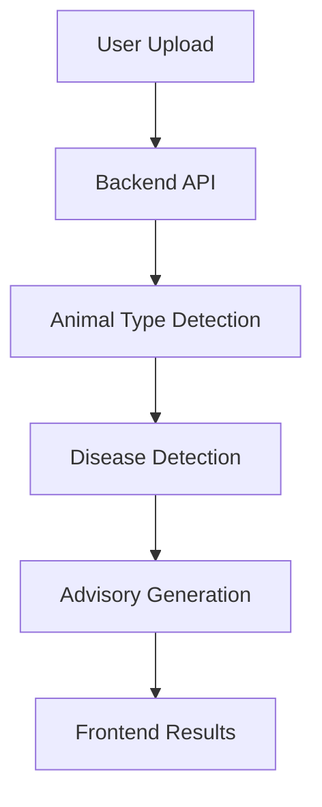

# AquaCare
AI-powered Fish & Shrimp Disease Detection System

AquaCare is an end-to-end disease detection platform for aquaculture that classifies uploaded fish and shrimp images, estimates disease confidence and severity, and returns practical advisory guidance for treatment and prevention. The project combines a FastAPI + TensorFlow backend with a React + TypeScript frontend, plus mobile packaging through Capacitor for Android support.

## Badges

[](https://react.dev)
[](https://www.typescriptlang.org)
[](https://fastapi.tiangolo.com)
[](https://www.tensorflow.org)
[](https://www.python.org)
[](https://vitejs.dev)
[](./LICENSE)

## 🌐 Live Demo

- Frontend: [https://aqua-health-system-frontend.vercel.app](https://aqua-health-system-frontend.vercel.app)
- Backend API: [https://aqua-health-system-backend.onrender.com](https://aqua-health-system-backend.onrender.com)
- Swagger API: [https://aqua-health-system-backend.onrender.com/docs](https://aqua-health-system-backend.onrender.com/docs)

## ✨ Features

- AI-powered disease detection
- Fish and shrimp classification
- Deep learning models for staged inference
- Disease confidence score
- Disease severity estimation
- Treatment recommendations
- Prevention guidance
- Disease library
- Scan history
- Mobile-friendly interface
- Android support using Capacitor
- Responsive UI

## 🧰 Technology Stack

### Frontend

| Technology | Purpose |
| --- | --- |
| React 18 | Component-based user interface |
| TypeScript | Type-safe application logic |
| Vite | Fast development server and production builds |
| React Router DOM | Client-side routing |
| TanStack Query | Async data and server-state management |
| Tailwind CSS + shadcn/ui + Radix UI | UI styling and accessible components |
| Capacitor | Android packaging and mobile runtime |

### Backend

| Technology | Purpose |
| --- | --- |
| Python 3.11 | Backend runtime |
| FastAPI | REST API and file upload handling |
| Uvicorn | ASGI server |
| Pillow | Image decoding and preprocessing |
| NumPy | Tensor manipulation |
| Requests | HTTP utilities used by the backend environment |

### Machine Learning

| Component | Details |
| --- | --- |
| Framework | TensorFlow / Keras |
| Input size | 224 x 224 x 3 |
| Type model | Binary classifier for fish vs shrimp |
| Fish model | 7-class disease classifier |
| Shrimp model | 4-class disease classifier |
| Base architecture | MobileNetV2 with frozen base and custom dense head |

### Deployment

| Platform | Purpose |
| --- | --- |
| Render | Backend hosting for FastAPI |
| Vercel | Frontend hosting for the Vite build |
| Android Studio + Capacitor | APK generation for mobile distribution |

## 🏗️ Project Architecture

```text
AquaCare/
├── backend/
│   ├── main.py
│   ├── Procfile
│   ├── render.yaml
│   ├── runtime.txt
│   ├── requirements.txt
│   ├── model/
│   │   ├── fish_disease_model.h5
│   │   ├── shrimp_disease_model.h5
│   │   └── type_classifier.h5
│   ├── training/
│   │   ├── train_fish_model.py
│   │   ├── train_shrimp_model.py
│   │   ├── train_type_model.py
│   │   └── compute_weights.py
│   └── Maindataset/
│       ├── download_dataset.py
│       ├── analyze_dataset.py
│       ├── create_fish_dataset.py
│       ├── create_type_dataset.py
│       ├── balance_shrimp_dataset.py
│       ├── balance_type_dataset.py
│       ├── check_labels.py
│       ├── view_samples.py
│       └── dataset/
├── frontend/
│   ├── src/
│   │   ├── App.tsx
│   │   ├── main.tsx
│   │   ├── components/
│   │   ├── data/
│   │   ├── hooks/
│   │   ├── lib/
│   │   ├── pages/
│   │   └── services/
│   ├── public/
│   ├── android/
│   ├── capacitor.config.ts
│   ├── vite.config.ts
│   ├── package.json
│   └── bun.lockb
└── README.md
```

## 🔄 Prediction Workflow



The backend performs a two-stage inference flow:

1. The uploaded image is resized to 224 x 224 and normalized.
2. The type classifier determines whether the image is fish or shrimp.
3. The appropriate disease model runs next.
4. The backend computes the top prediction and confidence score.
5. Confidence is converted into a severity label.
6. Advisory data is attached, including symptoms, causes, treatment, and prevention.
7. The frontend renders the result and stores the scan in local history.

## 🖼️ Screenshots

Add your screenshots here to present the product visually in GitHub:

| Screen | Placeholder |
| --- | --- |
| Home Screen | Add screenshot here |
| Scan Screen | Add screenshot here |
| Result Screen | Add screenshot here |
| Disease Library | Add screenshot here |
| History | Add screenshot here |
| Profile | Add screenshot here |

## 🧪 Machine Learning and Data Pipeline

### Model files loaded at runtime

| Model file | Purpose | Training script | Notes |
| --- | --- | --- | --- |
| `backend/model/type_classifier.h5` | Binary fish vs shrimp classifier | `backend/training/train_type_model.py` | MobileNetV2 backbone with dense head |
| `backend/model/fish_disease_model.h5` | Fish disease classifier | `backend/training/train_fish_model.py` | 7 output classes |
| `backend/model/shrimp_disease_model.h5` | Shrimp disease classifier | `backend/training/train_shrimp_model.py` | 4 output classes |

### Dataset preparation workflow

| Script | Purpose |
| --- | --- |
| `backend/Maindataset/download_dataset.py` | Downloads the source dataset from Hugging Face |
| `backend/Maindataset/create_fish_dataset.py` | Builds the fish-only training directory |
| `backend/Maindataset/balance_shrimp_dataset.py` | Copies and balances shrimp classes |
| `backend/Maindataset/create_type_dataset.py` | Creates the binary fish/shrimp dataset |
| `backend/Maindataset/balance_type_dataset.py` | Balances the binary type dataset |
| `backend/Maindataset/analyze_dataset.py` | Reviews class distribution |
| `backend/Maindataset/view_samples.py` | Visual sample inspection |
| `backend/Maindataset/check_labels.py` | Label validation |
| `backend/training/compute_weights.py` | Computes class weights from raw labels |

### Runtime mapping notes

- Fish classes are mapped from indices `0` to `6`.
- Shrimp classes are mapped from numeric folders `7`, `8`, `9`, and `10`.
- The shrimp directory order is corrected at runtime because Keras sorts folder names lexicographically.
- Unknown disease handling is triggered when confidence drops below the configured threshold.

## 📚 Technical Notes

- The backend enables CORS for `http://localhost:5173`, `http://localhost:8080`, and `https://aqua-health-system-frontend.vercel.app`.
- The API returns advisory fields for symptoms, causes, treatment, and prevention.
- The frontend stores scan history in `localStorage` under `scanHistory`.
- The frontend stores user profile data in `localStorage` under `userProfile`.
- `frontend/src/pages/Index.tsx` and related components exist as an alternate UI path, while the active router is defined in `frontend/src/App.tsx`.
- Default development ports are `8000` for the backend and `8080` for the frontend.

## 🛠️ Installation Guide

### Backend

The backend lives in [`backend/`](backend).

```powershell
cd C:\AHS\backend
python -m venv .venv
.\.venv\Scripts\Activate.ps1
pip install -r requirements.txt
uvicorn main:app --reload --host 0.0.0.0 --port 8000
```

### Frontend

The frontend lives in [`frontend/`](frontend).

```powershell
cd C:\AHS\frontend
npm install
npm run dev
```

### Environment Variables

| Variable | Scope | Purpose |
| --- | --- | --- |
| `VITE_API_URL` | Frontend | Points the UI to the deployed backend API in production |
| `PORT` | Backend hosting platform | Provided by Render and similar services at runtime |

The frontend uses `http://localhost:8000` during development and falls back to `https://aqua-health-system-backend.onrender.com` in production if `VITE_API_URL` is not set.

### Running Locally

1. Start the backend first so the API is available.
2. Start the frontend development server.
3. Open the frontend in the browser and upload an image from the scan page.
4. Confirm the result page shows the prediction, confidence, severity, and advisory guidance.

## 🚀 Deployment

### Render deployment

The backend includes the following deployment files:

- [`backend/Procfile`](backend/Procfile)
- [`backend/render.yaml`](backend/render.yaml)

The recommended Render start command is:

```bash
uvicorn main:app --host 0.0.0.0 --port $PORT
```

### Vercel deployment

The frontend is designed for static deployment to Vercel using the Vite build output in `dist/`.

Recommended build command:

```bash
npm run build
```

### Production environment variables

| Platform | Variable | Example value |
| --- | --- | --- |
| Frontend | `VITE_API_URL` | `https://aqua-health-system-backend.onrender.com` |
| Backend | `PORT` | Provided automatically by the hosting platform |

Before deploying the frontend, confirm that `VITE_API_URL` points to the live backend API so the scan flow works in production and inside the Android build.

## 📘 API Documentation

Base URL: `https://aqua-health-system-backend.onrender.com`

### `GET /`

Returns a simple service message.

**Example request**

```bash
curl https://aqua-health-system-backend.onrender.com/
```

**Example response**

```json
{
  "message": "Aqua Health System API running"
}
```

### `GET /health`

Returns the service health status.

**Example request**

```bash
curl https://aqua-health-system-backend.onrender.com/health
```

**Example response**

```json
{
  "status": "ok"
}
```

### `POST /predict/`

Accepts a multipart form upload with a `file` field containing the image to analyze.

**Example request**

```bash
curl -X POST "https://aqua-health-system-backend.onrender.com/predict/" \
  -F "file=@sample-image.jpg"
```

**Example response**

```json
{
  "type": "Fish",
  "disease": "Fin Rot / Tail Rot",
  "confidence": 92.5,
  "severity": "High",
  "symptoms": "Damaged fins/tail",
  "causes": "Bacteria or poor water",
  "treatment": "Antibiotics",
  "prevention": "Clean environment"
}
```

If the model confidence is too low, the API returns an unknown-disease response with an `Uncertain` severity and a message that the disease was not recognized in the trained dataset.

## 🛣️ Future Improvements

- Add persistent backend storage for scan history instead of browser-only storage.
- Introduce model versioning and a model metadata endpoint.
- Add automated API contract tests for `/predict/`.
- Expand the disease library with richer visual and clinical references.
- Add stronger observability around inference latency and error handling.
- Decide whether to retire or fully integrate the legacy `Index.tsx` UI path.

## 🤝 Contributing

Contributions are welcome. If you want to improve AquaCare:

1. Fork the repository.
2. Create a feature branch.
3. Make your changes with clear, focused commits.
4. Verify the backend and frontend still run correctly.
5. Open a pull request with a concise summary of the change.

Please keep changes consistent with the existing architecture, model workflow, and deployment assumptions.

## 📄 License

No LICENSE file is currently included in this repository.

If you plan to publish or distribute AquaCare, add a license file before treating the project as open source. MIT is a good default if that matches your intended usage and redistribution policy.

## 📬 Contact

Developer: Murali Krishna Medakayala

GitHub: [https://github.com/MuraliOnline-web](https://github.com/MuraliOnline-web)

LinkedIn: [https://www.linkedin.com/in/murali-krishna-medakayala-61b9ab2b9/](https://www.linkedin.com/in/murali-krishna-medakayala-61b9ab2b9/)
